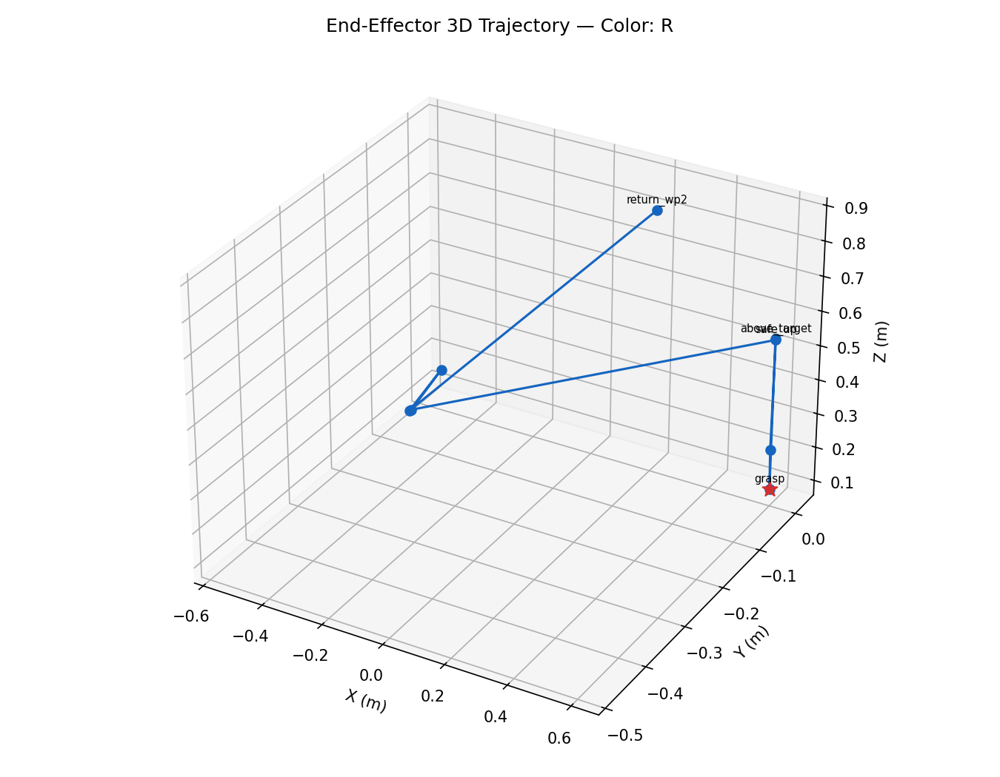

# Vision-Guided Pick-and-Place with Franka Panda

A ROS 2 simulation that detects colored objects and autonomously plans pick-and-place motions for a Franka Panda arm with an Allegro Hand. This repository contains the implementation from my undergraduate capstone in intelligent robotics.

## Highlights

- Detects red, green, and blue objects from a simulated RGB camera using OpenCV HSV segmentation.
- Transforms visual detections into the robot base frame with TF2.
- Plans collision-aware motions with MoveIt 2 and OMPL, then executes them through `ros2_control`.
- Models a 7-DOF Panda arm and 16-DOF Allegro Hand in Gazebo Fortress.
- Logs target/actual end-effector poses, joint states, planning outcomes, and step timings for reproducible evaluation.
- Recorded successful planning for all 80 motion steps across 10 logged trials. The representative trial in `results/` has a mean measured endpoint error of 1.51 mm across target-bearing steps.

## System pipeline

```text
Gazebo RGB camera
  -> OpenCV HSV segmentation
  -> TF2 coordinate transform
  -> MoveIt 2 / OMPL planning
  -> ros2_control execution
  -> trajectory and error logging
```

## Repository structure

```text
src/
  panda_bringup/      Integrated launch configuration
  panda_controller/   ros2_control configuration
  panda_description/  Robot, hand, sensor, and simulation models
  panda_moveit/       MoveIt 2 planning configuration
  panda_vision/       OpenCV color-detection node
  pymoveit2/          Vendored interface plus task and experiment scripts
results/              One representative experiment and visualizations
```

## Requirements

- Ubuntu 22.04
- ROS 2 Humble
- Gazebo Fortress
- MoveIt 2
- OpenCV and `cv_bridge`
- `ros_gz`, `ros2_control`, and `ign_ros2_control`

Install the principal ROS dependencies:

```bash
sudo apt update
sudo apt install ros-humble-moveit ros-humble-ros-gz \
  ros-humble-ros-gz-sim ros-humble-ros-gz-bridge \
  ros-humble-ros-gz-image ros-humble-ign-ros2-control \
  ros-humble-joint-trajectory-controller \
  ros-humble-joint-state-broadcaster ros-humble-cv-bridge \
  ros-humble-tf-transformations python3-opencv
```

## Build and run

```bash
source /opt/ros/humble/setup.bash
colcon build --symlink-install
source install/setup.bash
ros2 launch panda_bringup pick_and_place.launch.py
```

In a second terminal, select a target color (`R`, `G`, or `B`):

```bash
source /opt/ros/humble/setup.bash
source install/setup.bash
ros2 run pymoveit2 pick_and_place.py --ros-args -p target_color:=R
```

## Representative result



The accompanying `trial_data.json` records the target and actual end-effector coordinates, motion duration, plan status, and joint snapshots for each stage.

## Attribution

This project integrates open-source robot descriptions, simulation assets, ROS 2 packages, and the BSD-licensed [PyMoveIt2](https://github.com/AndrejOrsula/pymoveit2) interface by Andrej Orsula. The project-specific perception pipeline, system integration, pick-and-place task logic, evaluation logging, and experimental configuration are presented here as capstone work. Third-party assets and code remain under their respective licenses.

