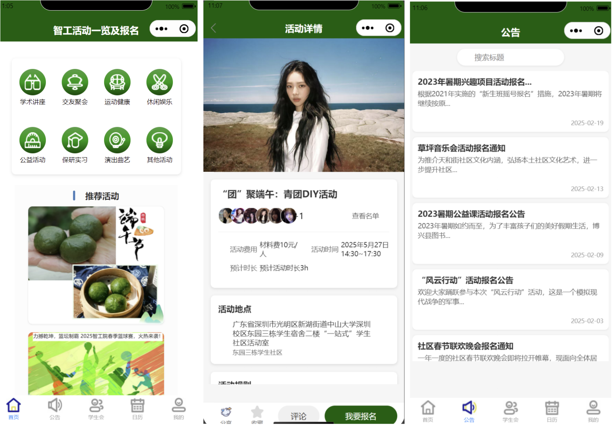

# WeChat Team Builder Mini Program

A WeChat Mini Program for creating and joining student teams. It combines a native Mini Program front end with Tencent CloudBase functions and a document database.

This repository contains the team-formation module from a broader Student Union Activity Platform developed for the course.

## Interface Preview

The composite below shows the broader platform's activity discovery, activity details and registration, and announcement interfaces. The source in this directory focuses on the team-formation module.



## Features

- Create a group with a team name, leader nickname, and student number
- Browse available groups ordered by group ID
- Join an existing group with duplicate-safe member arrays
- Identify callers through WeChat OpenID in cloud functions
- Store a user's nickname and avatar locally for a lightweight profile flow
- Prevent duplicate form submissions and validate required fields

## Architecture

```text
WeChat Mini Program pages
  -> wx.cloud.callFunction
  -> quickstartFunctions router
  -> createGroup / getGroup / joinGroup
  -> CloudBase document database (test-group collection)
```

## Run locally

1. Install and open WeChat DevTools.
2. Import this repository as a Mini Program project.
3. Replace the placeholder AppID with your own AppID in a local `project.private.config.json` or DevTools project settings.
4. Create a CloudBase environment and select it in DevTools.
5. Create a `test-group` collection and configure access permissions appropriate for your environment.
6. Upload and deploy `cloudfunctions/quickstartFunctions` with cloud dependencies.

No AppID, environment ID, OpenID, or private developer configuration is committed to this repository.

## Main directories

```text
miniprogram/pages/        Native page logic, templates, and styles
miniprogram/components/   Reusable UI components
cloudfunctions/           CloudBase function router and database operations
project.config.json       Shareable DevTools configuration with placeholder AppID
```

## Attribution

The project was developed for a software-engineering course using Tencent CloudBase's official quickstart scaffold. The group-creation, listing, joining, validation, and profile workflows are the course-project implementation layered on that scaffold. Tencent-provided assets and starter code remain subject to their original terms.
